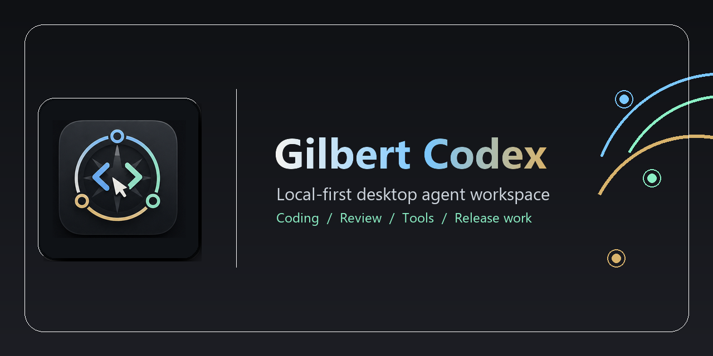
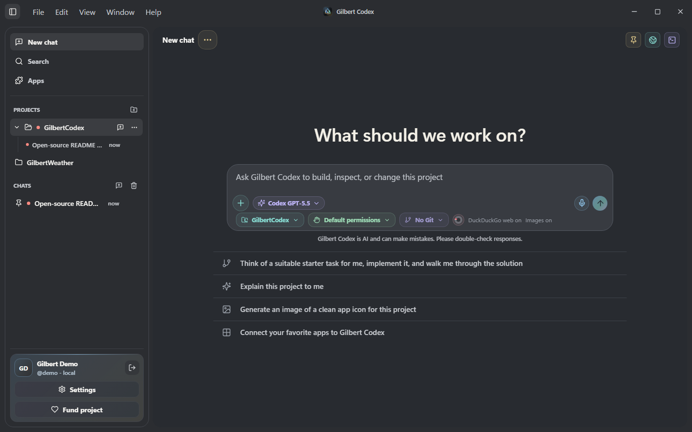
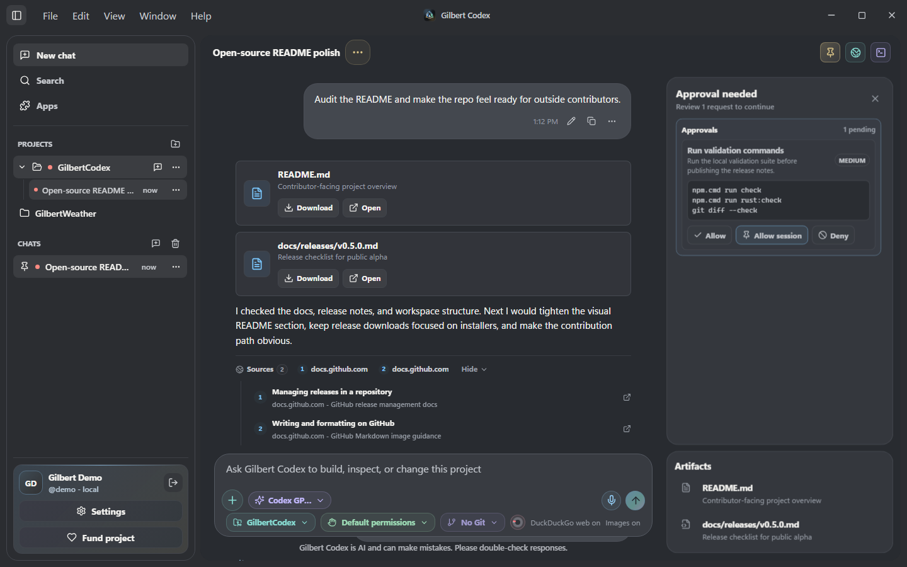
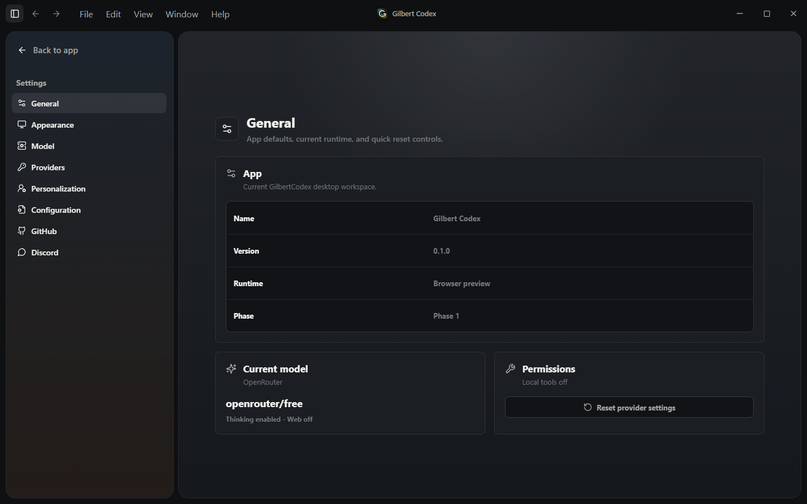
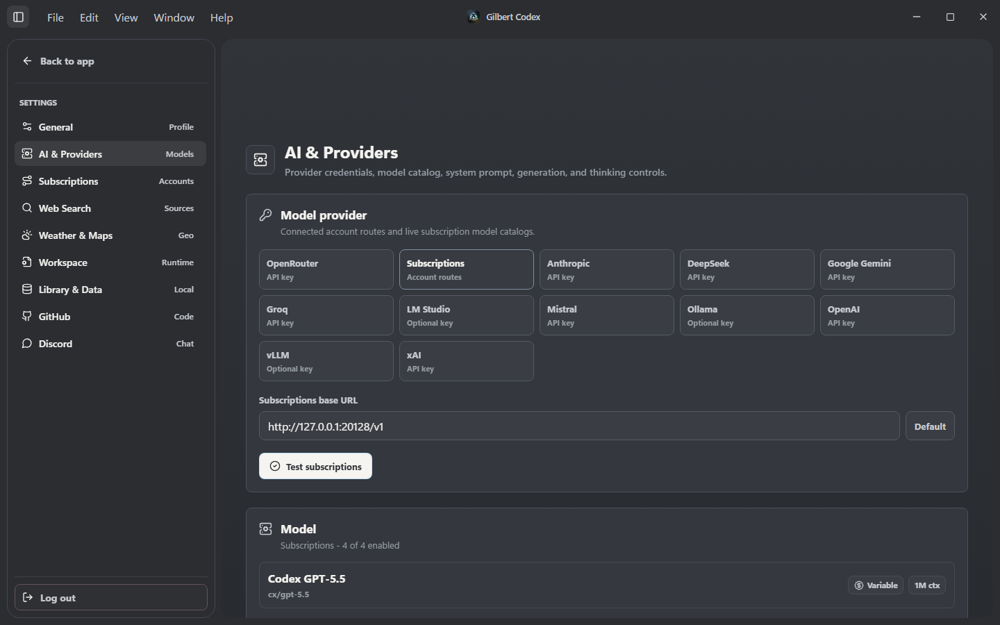
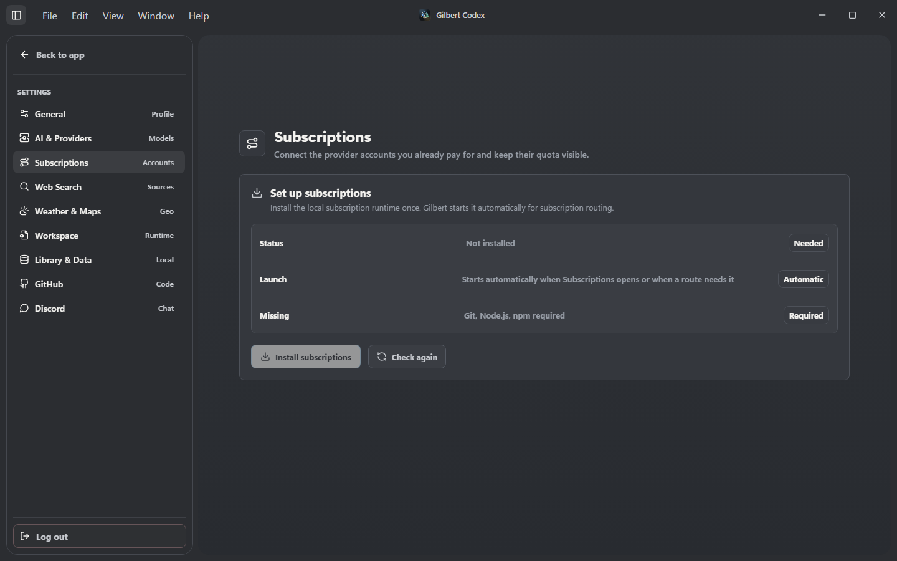
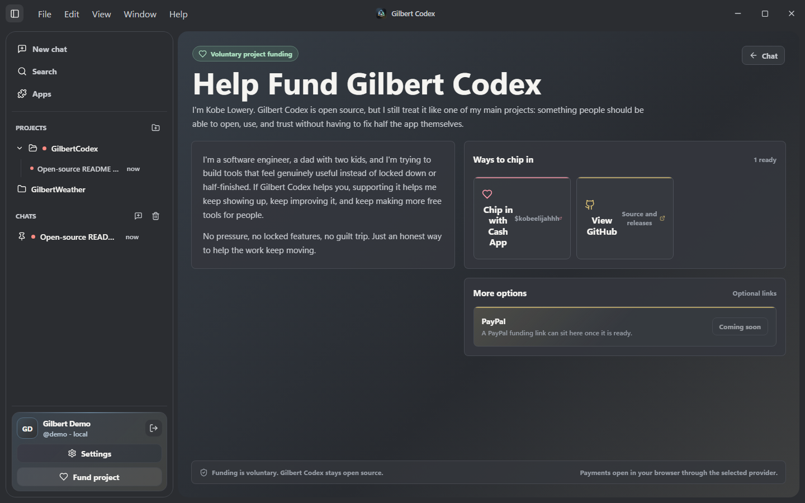

<p align="center">
  
</p>

<h1 align="center">Gilbert Codex</h1>

<p align="center">
  <strong>A local-first desktop AI agent workspace with MCP servers, Skills, plugins, connected apps, workspace tools, image creation, research, review, and release work.</strong>
</p>

<p align="center">
  <a href="docs/releases/v0.8.2.md">v0.8.2 release notes</a>
  |
  <a href="https://github.com/UrbanWafflezz/GilbertCodex/releases/tag/v0.8.2">Download v0.8.2</a>
  |
  <a href="docs/mcp/README.md">MCP setup</a>
  |
  <a href="docs/ROADMAP.md">Roadmap</a>
  |
  <a href="CONTRIBUTING.md">Contributing</a>
  |
  <a href="docs/SUPPORT.md">Support</a>
</p>

<p align="center">
  <a href="https://github.com/UrbanWafflezz/GilbertCodex/releases/tag/v0.8.2"></a>
  <a href="https://github.com/UrbanWafflezz/GilbertCodex/actions/workflows/release.yml"></a>
  <a href="https://modelcontextprotocol.io/"></a>
  <a href="https://tauri.app/"></a>
  <a href="https://react.dev/"></a>
  <a href="LICENSE"></a>
</p>

## v0.8.2 Is The Connected Platform Build

Gilbert Codex v0.8.2 is the build where the v0.8 platform work becomes much more usable day to day. It keeps the MCP, Skills, plugin, connected-app, thinking, tool, and cross-platform release foundation from v0.8.0/v0.8.1, then deepens the real runtime paths: richer Apps and MCP setup, reusable non-model keys, stronger connected-tool evidence, provider cache accounting, and better native command discovery on Windows, macOS, and Linux.

This is still alpha software, but the v0.8.x line is a major line in the sand: Gilbert now has the pieces for connected tools, reusable workflows, plugin-powered capability growth, and cross-platform desktop distribution. v0.8.2 is the build new testers should start from.

High-impact local actions, destructive operations, credential access, publishing, terminal commands, and outside-scope paths are still guarded by explicit review/permission flows. Provider keys, local accounts, OAuth credentials, logs, databases, private tool overlays, generated build output, and release signing secrets stay out of public Git.

Known alpha issue: ChatGPT GPT-5.3 Spark is currently read-only for workspace work. It can inspect files, but write/edit tool calls are not completing reliably on that route yet. Use the other available Codex/ChatGPT, OpenRouter, or local routes for file changes until this is fixed.

## What Shipped

| Area | v0.8.x upgrade |
| --- | --- |
| v0.8.2 platform depth | The app now has a shared native command resolver for packaged macOS/Linux launches, host-aware build and release dispatch, platform updater configs, CI native-path checks, and release jobs for Windows x64, macOS Apple Silicon/Intel, and Linux x64. |
| MCP servers | Apps > MCP supports remote HTTP, localhost HTTP, and command-line stdio servers, with secure bearer tokens, custom secret headers, secret query params, stdio env vars, live setup testing, registry search, cached tool schemas, and chat-callable MCP tools. |
| Skills | Skills are now app-managed reusable instruction bundles. Gilbert ships premade workflows, imports `SKILL.md` folders, supports custom skills, enables/disables skills, and can activate them by `$trigger` or prompt match. |
| Apps, plugins, and marketplace | The Apps hub now carries Discover, Installed, MCP, Skills, Create, and Marketplace paths with many more curated plugin listings, manifest previews, setup requirements, installed-state tags, and supported routes into native apps, MCP presets, registry search, or skill import. |
| OpenAI/Codex plugin bridge | Gilbert can read OpenAI/Codex plugin marketplace metadata, map supported plugins to native connectors or MCP presets, and import bundled plugin skills into the local skill registry. |
| Keys vault | Settings > Keys stores non-model API keys for MCP, skills, apps, and services through the desktop secure-storage path, then lets MCP setup reuse saved credentials without exposing values back to the UI or chat. |
| Thinking and work visibility | Thinking mode has clearer controls and the chat now shows safer "Working" / "Worked" traces for progress, tools, approvals, file batches, web/search activity, and retries without leaking raw provider reasoning. |
| Tool reliability | Local computer tools gained stronger file-change evidence, batch write/edit summaries, stale-edit protection, binary handling, approval recovery, tool-output finalization, retry guidance for malformed tool calls, and stricter recovery when a connected-app or deployment answer lacks real tool evidence. |
| Connected apps | Gmail, Google Calendar, GitHub, Discord, web search, browser preview, terminal, files, local Git, and MCP-backed services now fit into the same app-owned permission and progress model. |
| Provider usage | Provider requests now track cached input and cache-write tokens where providers report them, estimate cache savings, and attach provider cache metadata for supported OpenAI/Anthropic/xAI routes. |
| Cross-platform release | The GitHub Release workflow publishes Windows x64, macOS Apple Silicon/Intel, and Linux x64 artifacts with updater signatures, checksums, and `latest.json` update-feed entries. macOS artifacts are ad-hoc signed and unnotarized until Apple Developer signing/notarization secrets are configured. |

## Download

The v0.8.2 desktop alpha is the current build on [GitHub Releases](https://github.com/UrbanWafflezz/GilbertCodex/releases/tag/v0.8.2).

| Platform | Release artifacts |
| --- | --- |
| Windows x64 | `Gilbert-Codex-0.8.2-x64-setup.exe`, `.sig`, `.sha256` |
| macOS Apple Silicon | `Gilbert-Codex-0.8.2-macos-aarch64.dmg`, updater archive, `.sig`, `.sha256`; ad-hoc signed until Apple notarization is configured |
| macOS Intel | `Gilbert-Codex-0.8.2-macos-x64.dmg`, updater archive, `.sig`, `.sha256`; ad-hoc signed until Apple notarization is configured |
| Linux x64 | `Gilbert-Codex-0.8.2-linux-x64.deb`, `Gilbert-Codex-0.8.2-linux-x64.AppImage`, `.sig`, `.sha256` |
| Updater feed | `latest.json` with Windows, macOS, and Linux entries |

The release workflow builds Windows, macOS arm64, macOS x64, and Linux x64 on GitHub-hosted native runners.

macOS and Linux packages are built on GitHub-hosted native runners and are now part of the release workflow, but they still need real-device launch smoke tests before those platforms should be called fully verified. The workflow builds ad-hoc signed, unnotarized macOS artifacts when Apple Developer signing and notarization secrets are not configured; local macOS inspection builds use the same ad-hoc signing path.

## Screenshots

<table>
  <tr>
    <td width="50%">
      <strong>Focused chat workspace</strong><br>
      
    </td>
    <td width="50%">
      <strong>Live progress, sources, and approvals</strong><br>
      
    </td>
  </tr>
  <tr>
    <td width="50%">
      <strong>General settings</strong><br>
      
    </td>
    <td width="50%">
      <strong>Subscription model settings</strong><br>
      
    </td>
  </tr>
  <tr>
    <td width="50%">
      <strong>Subscription setup</strong><br>
      
    </td>
    <td width="50%">
      <strong>Project support</strong><br>
      
    </td>
  </tr>
</table>

## MCP, Skills, And Plugins

### MCP Servers

Gilbert Codex now treats MCP as a first-class app feature instead of a hidden config file.

- Add remote HTTP endpoints, localhost development endpoints, or stdio command servers from Apps > MCP.
- Store bearer tokens and stdio environment values through OS-backed secure storage.
- Search the MCP Registry and install normalized server definitions into the same save/test/chat path.
- Start from 20 curated presets: Firebase, Figma, Supabase, AWS, GitLab, GitHub MCP, Linear, Stripe, Atlassian, Vercel, Notion, Cloudflare, Context7, Redis, MongoDB, Sentry, Kubernetes, and more.
- Run Test all to refresh cached tool schemas and surface per-server failures.
- Let chat list configured servers, list tool schemas, and call MCP tools when MCP is enabled in tool settings.
- Keep OAuth callback codes, state values, bearer tokens, and env values out of visible chat/tool output.

See [MCP Support](docs/mcp/README.md) for setup details, transport notes, Firebase auth guidance, and protocol behavior.

### Skills

Skills are reusable instruction bundles that Gilbert can inject only when they match the turn.

- Premade skills include `$coding`, `$frontend`, `$review`, `$research`, `$skill-creator`, and `$release`.
- Apps > Skills can install presets, import a folder containing `SKILL.md`, create a new custom skill, edit skill metadata/instructions, enable or disable skills, and copy triggers.
- The composer has a skill mention picker, so a user can type `$review` or `$research` and select an installed skill directly.
- The runtime can also match enabled skills by description when the prompt clearly fits the workflow.
- Skill instructions are capped for prompt budget so large skill files do not swallow the whole context window.

### Plugins

Plugins now have a real directory experience.

- Browse the local first-party plugins plus the upstream marketplace-backed catalog across coding, code intelligence, apps/data, research, design, security, testing, delivery, and authoring.
- Track installed plugins separately from discoverable plugins.
- Inspect components such as Skills, MCP, Agents, Hooks, LSP, and Monitors with permission sensitivity labels.
- Preview a plugin manifest while creating a workspace-local plugin.
- Use OpenAI/Codex marketplace metadata to route plugins toward native app connectors, MCP presets/search, or bundled skill import where supported.
- Default installed plugin concepts include GitHub, Playwright browser automation, Figma, Stripe, and CodeRabbit.

The plugin marketplace is still being polished, but the v0.8.x line moves it out of "idea" territory and into a working foundation for real capability packs.

## Product Shape

- Desktop shell: Tauri 2 window, custom chrome, local app metadata, Rust commands, branded installer assets, updater-ready release config, host-aware build/release dispatch, and Windows/macOS/Linux bundle outputs.
- Local users: local account creation and sign-in for namespaced chat, project, settings, Skills, MCP, app-connector, and workspace state.
- Chat workspace: searchable history, pinned chats, generated chat titles, project grouping, markdown rendering, image/file attachments, regeneration, queued sends, targeted stop controls, bulk delete review, and local persistence.
- Model runtime: OpenRouter, OpenAI, Anthropic, Google Gemini, xAI, LM Studio, Ollama, Groq, Mistral, and DeepSeek chat streaming with live model catalogs where available, provider usage tracking, thinking controls, planning mode, empty-response retry handling, and malformed-tool retry guidance.
- Subscription routing: optional local subscription routing for Codex / ChatGPT, Claude Code, Gemini CLI / Cloud Code, GitHub Copilot, and other supported provider accounts, with account sign-in, sign-out, usage visibility, model catalogs, and OpenRouter fallback.
- Skills and plugins: local skill registry, premade/custom/imported skills, plugin catalog, installed-state tracking, OpenAI/Codex marketplace import routes, plugin manifest preview, and component-aware permission language.
- MCP and connected tools: MCP server registry/presets/custom setup, secret headers/query params/env values, credential reuse from Settings > Keys, Gmail, Google Calendar, GitHub, Discord, browser preview, web search, local terminal, local Git, and workspace file actions.
- Image generation: chat can attach generated image artifacts through subscription image routes, with composer controls, progress, image grids, lightbox preview, and downloads.
- Voice input: offline Whisper dictation for desktop builds, bundled model resources, configurable dictation hotkeys, and dictionary entries.
- Source context: DuckDuckGo/Brave-backed source cards, thinking/planning support, browser preview capture, citation-aware web context, and clearer fallback messaging.
- Review posture: destructive chat deletion confirmation, explicit local workspace permission modes, source-write guardrails, connected-tool evidence checks, desktop notification permission checks, Tauri CSP, least-privilege notification capabilities, and visible activity/progress cards.
- Settings: provider key/base URL entry, non-model Keys vault presets for MCP, skills, apps, and services, subscription account setup, subscription model catalogs without a required local API key, GitHub browser login, Google OAuth setup, Discord bridge setup/runtime controls, optional support links, connection validation, appearance mode, UI/chat/composer sizing, motion, voice dictation, model, generation, thinking, workspace, app, plugin, and MCP controls.

## Support

Gilbert Codex stays open source and usable without payment. Optional project funding is available through the app's Fund project page, GitHub's Sponsor button, and [Cash App $kobeelijahh](https://cash.app/$kobeelijahh). See [Funding Gilbert Codex](docs/SUPPORT.md) for the safety rules and hosted-link setup notes.

## Coming Next

v0.8.2 keeps hardening the extensible platform. The next work is about making that platform smoother, deeper, and more trustworthy in real daily use.

- Polish the Apps, Skills, and Plugins hub so installed, available, imported, and coming-soon capabilities are easier to scan.
- Deepen the plugin install path beyond the current native/MCP/skill-import routes.
- Improve activity cards so tools, files, approvals, sources, retries, artifacts, and long-running jobs read cleanly.
- Expand provider compatibility tests for subscription routes, image generation, tool schemas, tool-result replay, malformed-call recovery, and streaming edge cases.
- Improve GitHub/source-control UI with richer review cards, diff review, PR handoff, release workflow visibility, and CI status.
- Add stronger model/provider UX: capability badges, context hints, local/cloud filters, provider profiles, and task presets.
- Continue macOS and Linux launch verification, signing/notarization work, installer diagnostics, and public alpha validation notes.

See the full [roadmap](docs/ROADMAP.md) for the active direction.

## Repository Layout

```text
.
|-- .github/               Issue forms, PR template, CODEOWNERS, CI, release workflow, and Dependabot
|-- public/                 Static app assets
|-- docs/                   Project docs, release notes, and publishing checklists
|   |-- INSTALLER.md        Windows customer installer build and release checklist
|   |-- mcp/                MCP setup and protocol notes
|   |-- platform/           Platform support matrix and macOS/Linux port checklist
|   `-- ROADMAP.md          Upcoming product and contributor roadmap
|-- src/                    React frontend
|   |-- app/                App composition, auth, runtime helpers, Tauri clients
|   |-- components/         Reusable UI grouped by product area
|   |-- features/           Plugin catalog, skill mention, and capability feature helpers
|   |-- lib/                Storage, chat helpers, model metadata, context windows
|   |-- pages/              Top-level app surfaces, Apps, Settings, Tasks
|   |-- localWorkspace/     Host-provided workspace context helpers
|   |-- services/           Provider, planning, usage, skills, and web-search clients
|   |-- styles/             CSS split by surface
|   `-- types/              Shared TypeScript contracts
|-- src-tauri/              Tauri 2 and Rust host layer
|   |-- capabilities/       Window and runtime permissions
|   |-- icons/              App icon assets generated from the project logo
|   |-- windows/            Branded NSIS installer artwork
|   |-- src/commands/       Auth, app info, browser, Discord, GitHub, MCP, terminal, web, and workspace commands
|   |-- src/core/           Rust storage, secure-storage, and filesystem helpers
|   `-- tauri.conf.json     Desktop app configuration
|-- CONTRIBUTING.md         Local setup and contribution rules
|-- PROGRESS.md             Current phase history and roadmap
|-- SECURITY.md             Responsible disclosure and local-data notes
`-- README.md              Project overview
```

## Getting Started

For platform-specific status and porting work, start with [docs/platform/README.md](docs/platform/README.md).

Prerequisites:

- Node.js 18 or newer for the Gilbert app. Node.js 20 or newer is required when installing the local Subscriptions/9Router source runtime.
- Rust and Cargo.
- Microsoft WebView2 Runtime on Windows.
- WebKitGTK runtime/development packages on Linux when running or building the Tauri desktop shell.
- `libsecret-tools` and a Secret Service provider on Linux for OS-backed secrets.

Install dependencies:

```bash
npm install
```

Run the frontend preview:

```bash
npm run dev
```

Run the full desktop app:

```bash
npm run app:dev
```

Run the full repository check:

```bash
npm run check
```

Optional production dependency audit:

```bash
npm run audit:prod
```

Individual checks:

```bash
npm run build
npm run rust:fmt:check
npm run rust:check
npm test
git diff --check
```

On Windows PowerShell, `npm.cmd` is also supported if local script execution policy blocks the `npm` shim.

Build the Windows customer installer:

```powershell
npm.cmd run app:installer
```

Build native release bundles on the current host:

```bash
npm run app:release
npm run app:release:macos
npm run app:release:linux
```

See [Windows Installer](docs/INSTALLER.md) for what is bundled, what stays local, and the release checklist.

## Local Data And Secrets

Gilbert Codex is local-first. Provider keys and local endpoint URLs are entered through Settings and treated as local user data, not repository configuration. Desktop local accounts are stored in the local Gilbert Database, and the browser preview uses localStorage as a development fallback. Do not commit real API keys, local databases, logs, terminal output, private workspace data, or build artifacts.

GitHub browser login uses OAuth device flow. Create a GitHub OAuth App with device flow enabled, paste the public Client ID into Settings > GitHub, and sign in from there. No GitHub client secret belongs in the desktop app or release workflow. GitHub actions use the locally stored access token and should remain behind visible review or permission boundaries for high-impact actions.

Gmail and Google Calendar sign-in use Google OAuth for desktop apps. Each user adds their own Google Cloud desktop OAuth Client ID and Client secret in Settings > Google, then installs Gmail or Google Calendar from Apps and chooses a Google account in the browser. No shared Google OAuth client ID, Google access token, refresh token, or downloaded credential file belongs in the repository.

MCP bearer tokens and stdio environment values are stored through the app's OS-backed secure storage. The React UI and chat tools only see whether a secret exists; they do not receive the secret values back.

Release-only app configuration stays out of the public source tree. The GitHub `Release` workflow restores private app-only runtime files from a private release overlay before building desktop artifacts, including the private tool bridge and optional plugin bundles. App-user OAuth values, provider keys, local accounts, and support links are not required as release secrets; users configure those inside the installed app.

Discord bridge settings are local setup data for the desktop Discord runtime. Slash-command chat uses a signed local Interactions receiver and can start ngrok in the background to produce a public HTTPS endpoint. `/gilbert` continues the latest Discord-linked chat, while `/gilbertnewchat` intentionally starts a fresh chat. Incoming Discord webhooks are one-way posting URLs for app updates and chat follow-ups. Bot gateway chat is still future runtime work.

See [SECURITY.md](SECURITY.md) before sharing bug reports that include logs, screenshots, workspace paths, terminal output, provider errors, or local automation output.

## Integration Setup

- [MCP Support](docs/mcp/README.md): MCP transports, stdio setup, registry discovery, featured presets, chat tools, and protocol notes.
- [Platform support and porting notes](docs/platform/README.md): Windows verification status, macOS/Linux port readiness, and the native testing checklist.
- [Discord integration setup](docs/discord/README.md): Discord application setup, one-click ngrok-backed slash-command bridge setup, bot gateway notes, and incoming webhooks.
- [Gmail plugin setup](docs/gmail/README.md): Google OAuth desktop setup, user connection flow, requested scopes, and Gmail confirmation rules.
- [Google OAuth setup](docs/google/README.md): Bring-your-own Google OAuth client setup and production verification notes.
- [GitHub integration setup](docs/github/README.md): GitHub OAuth App device-flow setup, requested scopes, Settings sign-in, repository actions, and webhook troubleshooting.

## Collaboration

Before opening a pull request, run:

```bash
npm run check
npm run audit:prod
git diff --check
```

Use [CONTRIBUTING.md](CONTRIBUTING.md) for coding and review standards, [docs/CODE_DOCUMENTATION.md](docs/CODE_DOCUMENTATION.md) for source comment expectations, and [PROGRESS.md](PROGRESS.md) for the current roadmap.

Branch and contribution flow:

- Normal contributor work targets `develop`.
- QA batches promote from `develop` to `testing`.
- Release-ready work promotes from `testing` to `main`.
- The detailed workflow lives in [docs/BRANCHING.md](docs/BRANCHING.md) and [docs/CONTRIBUTION_PROCESS.md](docs/CONTRIBUTION_PROCESS.md).

## License

Gilbert Codex is released under the [MIT License](LICENSE).
