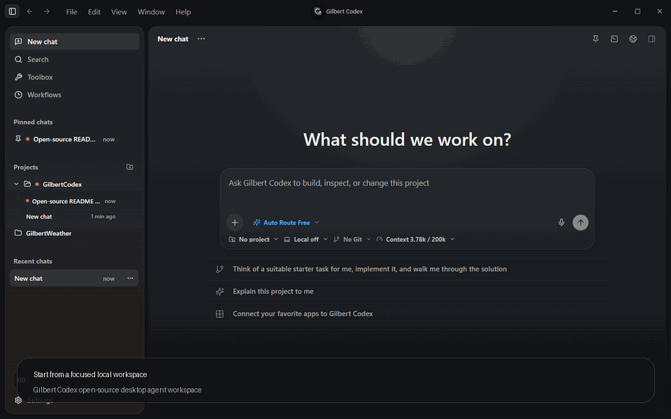
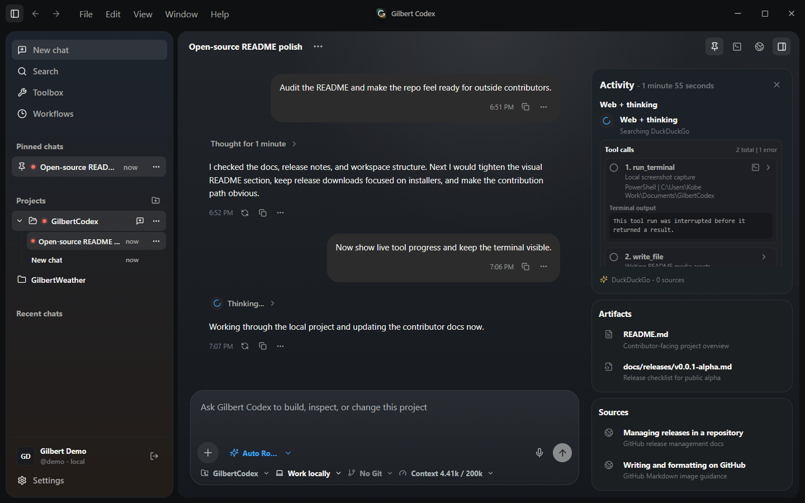
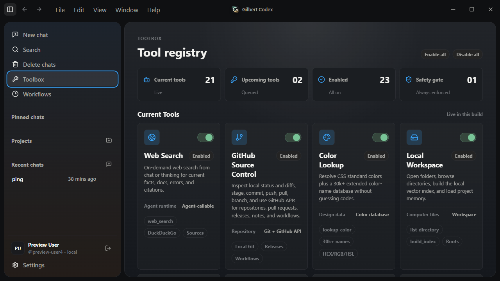

# Gilbert Codex

Gilbert Codex is a GUI-first local desktop agent workspace for building, reviewing, and steering code from one focused surface. The app combines React, TypeScript, Tauri 2, and a Rust command layer so agent workflows can run close to the local workspace without requiring a hosted backend for the first public milestone.

[](https://tauri.app/)
[](https://react.dev/)
[](https://www.typescriptlang.org/)
[](LICENSE)

## Preview



| Focused chat workspace | Live tool activity and artifacts |
| --- | --- |
|  |  |

| Tool registry | Local settings |
| --- | --- |
|  |  |

## Current Status

Gilbert Codex is in an early public alpha desktop foundation phase. The app currently includes local account sign-in, a chat workspace, project-scoped local state, multi-provider model streaming, planning mode, web search, local computer file context, modular local tools, workflow automation, local Git source control, GitHub source control, Discord slash-command bridge setup/runtime, terminal sessions, browser preview, tool toggles, settings, desktop notifications, and a Tauri command bridge.

The v0.3.0 update is a major tool-runtime and release-readiness pass after `09d34f17`: the old local tool executor has been split into focused modules, `workflow_run` now sequences higher-level evidence-gathering workflows, provider-native local tools are intentionally disabled behind the shared XML protocol until native tool-result persistence is ready, and the activity UI now emphasizes visible tool-call status over raw thinking traces.

Known issue for this build: some hosted models have trouble with tool calls even when normal chat works. Some emit malformed tool XML/JSON, some ignore tool instructions, and some OpenAI-compatible routes do not behave like the upstream provider. Other models work correctly, and local models through LM Studio or Ollama work when the selected endpoint/model follows Gilbert's shared tool protocol.

Platform status: Windows x64 is the verified alpha target. macOS and Linux now have partial source support, but they still need contributors on those operating systems to run the app, package it, and finish any native port issues. See [Platform Support And Porting Notes](docs/platform/README.md).

The repository is kept open-source ready by default: dependencies, build output, local logs, generated targets, local databases, and secrets stay out of Git. Source files are grouped by product surface so contributors can find the UI, runtime clients, tools, types, and Rust commands without reverse-engineering the whole app.

## Download

The latest Windows public alpha is available from [GitHub Releases](https://github.com/UrbanWafflezz/GilbertCodex/releases/tag/v0.3.0).

Download the Windows x64 setup executable, run it, and configure provider keys or local endpoints in Settings. The customer installer uses Tauri's NSIS packaging, branded light/dark-safe setup artwork, a license page, Start menu metadata, and a WebView2 runtime check. This alpha is unsigned, so Windows SmartScreen may show an extra confirmation prompt.

macOS and Linux release artifacts are not official yet. The repo has partial source support for both platforms, and contributors with those operating systems are needed to test and complete the port.

See [v0.3.0 release notes](docs/releases/v0.3.0.md) for the major alpha update, tool/model compatibility notes, updater status, setup notes, known limitations, validation commands, and checksum details.

## Product Shape

- Desktop shell: Tauri 2 window, custom chrome, local app metadata, and Rust commands.
- Local identity: local account creation and sign-in for namespaced chat, project, settings, and workspace state.
- Chat workspace: searchable history, pinned chats, generated chat titles, project grouping, markdown rendering, image/file attachments, regeneration, targeted stop controls, and local persistence.
- Model runtime: OpenRouter, OpenAI, Anthropic, Google Gemini, xAI, LM Studio, Ollama, Groq, Mistral, and DeepSeek chat streaming with live model catalogs where available, provider usage tracking, thinking controls, planning mode, and empty-response retry handling.
- Tools: `workflow_run`, web search, weather, color lookup, local Git status/diff/stage/commit/push/pull/branch tools, GitHub repository/release/workflow tools, MCP discovery/call tools, local file indexing, file read/write/delete helpers, precise `edit_file`/`edit_files`/`inline_edit`, duplicate-safe typed TXT/Markdown/code/React/HTML/PDF file creation, batch file creation, context recall, browser folder fallback, interactive PTY terminal sessions, terminal-backed background command attachment, browser preview, browser automation, and Toolbox feature toggles.
- Review posture: destructive chat deletion confirmation, explicit local workspace permission modes, approval cards for risky tools, source-write guardrails that prefer structured edits over shell-generated file writes, desktop notification permission checks, a configured Tauri CSP, least-privilege notification capabilities, and visible activity/progress cards.
- Settings: provider key/base URL entry, GitHub browser login, Discord bridge setup/runtime controls, connection validation, appearance mode, model, generation, thinking, and web-search controls.

## Coming Next

- Stability Pack follow-ups: broader provider/model compatibility tests, safer local tool recovery, durable long-running jobs, and clearer update/install diagnostics.
- Native tool-result persistence: provider-native local tools can come back after Gilbert can persist native tool-call IDs and send provider-native tool-result content on later turns.
- Model selector revamp: provider profiles, model capability badges, context-window hints, local/cloud filtering, and faster switching between coding, planning, reasoning, and multimodal models.
- Multimodal creation tools: image generation/editing, image-to-code workflows, video generation job tracking, thumbnails, and saved media artifacts.
- Messaging integrations: WhatsApp support research focused on compliant Business Platform flows, plus stronger Discord/GitHub notification routing.
- Collaboration polish: richer source-control review cards, PR handoff helpers, issue templates, roadmap labels, and contributor-friendly first tasks.

## Repository Layout

```text
.
|-- .github/               Issue forms, PR template, CODEOWNERS, CI, and Dependabot
|-- public/                 Static app assets
|-- docs/                   Project docs, tool contracts, and publishing checklists
|   |-- INSTALLER.md        Windows customer installer build and release checklist
|   |-- platform/           Platform support matrix and macOS/Linux port checklist
|-- src/                    React frontend
|   |-- app/                App composition, auth, runtime helpers, Tauri clients
|   |-- components/         Reusable UI grouped by product area
|   |-- lib/                Storage, chat helpers, model metadata, context windows
|   |-- pages/              Top-level app surfaces
|   |-- services/           Provider, planning, usage, and web-search clients
|   |-- styles/             CSS split by surface
|   |-- tools/              Browser, GitHub, and local-computer tool executors
|   `-- types/              Shared TypeScript contracts
|-- src-tauri/              Tauri 2 and Rust host layer
|   |-- capabilities/       Window and runtime permissions
|   |-- icons/              App icon assets generated from the project logo
|   |-- windows/            Branded NSIS installer artwork
|   |-- src/commands/       Auth, app info, computer, Discord, GitHub, terminal, and web commands
|   |-- src/core/           Rust provider, job, storage, and agent scaffolding
|   `-- tauri.conf.json     Desktop app configuration
|-- CONTRIBUTING.md         Local setup and contribution rules
|-- PROGRESS.md             Current phase history and roadmap
|-- SECURITY.md             Responsible disclosure and local-data notes
`-- README.md              Project overview
```

## Getting Started

For platform-specific status and porting work, start with [docs/platform/README.md](docs/platform/README.md). Windows is verified; macOS and Linux are partial until tested on real machines.

Prerequisites:

- Node.js 18 or newer.
- Rust and Cargo.
- Microsoft WebView2 Runtime on Windows.
- WebKitGTK runtime/development packages on Linux when running or building the Tauri desktop shell.

Install dependencies:

```bash
npm install
```

Run the frontend preview:

```bash
npm run dev
```

Run the full desktop app:

```bash
npm run app:dev
```

Run the full repository check:

```bash
npm run check
```

Optional production dependency audit:

```bash
npm run audit:prod
```

Individual checks:

```bash
npm run build
npm run rust:fmt:check
npm run rust:check
```

On Windows PowerShell, `npm.cmd` is also supported if local script execution policy blocks the `npm` shim.

Build the Windows customer installer:

```powershell
npm.cmd run app:installer
```

See [Windows Installer](docs/INSTALLER.md) for what is bundled, what stays local, and the release checklist.

## Local Data And Secrets

Gilbert Codex is local-first. Provider keys and local endpoint URLs are entered through Settings and treated as local user data, not repository configuration. Desktop local accounts are stored in the local Gilbert Database, and the browser preview uses localStorage as a development fallback. Do not commit real API keys, local databases, logs, terminal output, private workspace data, or build artifacts.

GitHub browser login uses OAuth device flow. For local development, create a GitHub OAuth App with device flow enabled, copy `.env.example` to `.env`, set `VITE_GITHUB_OAUTH_CLIENT_ID` to the public client ID, and sign in from Settings. No client secret belongs in the desktop app. The app requests a broad GitHub OAuth scope bundle at sign-in so source-control, workflow-file, package, gist, organization, and repository-admin tools can work when the signed-in account is allowed to perform those actions.

Discord bridge settings are local setup data for the desktop Discord runtime. Slash-command chat uses a signed local Interactions receiver and can start ngrok in the background to produce a public HTTPS endpoint. `/gilbert` continues the latest Discord-linked chat, while `/gilbertnewchat` intentionally starts a fresh chat. Incoming Discord webhooks are one-way posting URLs for app updates and chat follow-ups. Bot gateway chat is still future runtime work.

See [SECURITY.md](SECURITY.md) before sharing bug reports that include logs, screenshots, workspace paths, terminal output, or provider errors.

## Integration Setup

- [Platform support and porting notes](docs/platform/README.md): Windows verification status, macOS/Linux partial support, and the native testing checklist.
- [Discord integration setup](docs/discord/README.md): Discord application setup, one-click ngrok-backed slash-command bridge setup, bot gateway notes, and incoming webhooks.
- [GitHub integration setup](docs/github/README.md): GitHub OAuth App device-flow setup, requested scopes, Settings sign-in, repository tools, and webhook troubleshooting.

## Collaboration

Before opening a pull request, run:

```bash
npm run check
npm run audit:prod
git diff --check
```

Use [CONTRIBUTING.md](CONTRIBUTING.md) for coding and review standards, [docs/CODE_DOCUMENTATION.md](docs/CODE_DOCUMENTATION.md) for source comment expectations, and [PROGRESS.md](PROGRESS.md) for the current roadmap.

Branch and contribution flow:

- Normal contributor work targets `develop`.
- QA batches promote from `develop` to `testing`.
- Release-ready work promotes from `testing` to `main`.
- The detailed workflow lives in [docs/BRANCHING.md](docs/BRANCHING.md) and [docs/CONTRIBUTION_PROCESS.md](docs/CONTRIBUTION_PROCESS.md).

## License

Gilbert Codex is released under the [MIT License](LICENSE).
